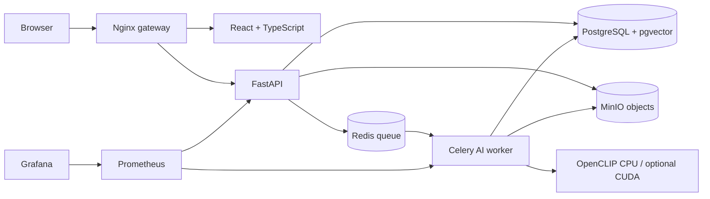

# ImageVault AI

> Intelligent private-cloud image storage, exact duplicate detection, and local visual similarity—built as a Cloud Computing & DevOps mini-project with no additional software or cloud-service expenditure.

ImageVault AI stores original images in private S3-compatible MinIO object storage, keeps metadata and 512-dimensional vectors in PostgreSQL/pgvector, and processes new images asynchronously with a CPU-compatible OpenCLIP worker. Docker, Kubernetes, Terraform, GitHub Actions, Nginx, Prometheus, and Grafana make the cloud platform—not the model alone—the academic contribution.

## What it demonstrates

- Local account registration and JWT login with Argon2 password hashing.
- User-isolated batch upload for JPG, PNG, and WebP files, with progress and cancellation.
- Byte-for-byte duplicate detection through SHA-256 before expensive AI inference.
- Perceptual pHash and local OpenCLIP ViT-B/32 similarity, indexed with pgvector cosine distance.
- Private MinIO originals, generated WebP thumbnails, metadata, gallery filters, image details, explicit deletion, and duplicate review.
- Live storage analytics, health/readiness/liveness endpoints, Prometheus metrics, and an automatically provisioned Grafana dashboard.
- A multi-service Docker Compose deployment plus Minikube/Kubernetes and Terraform alternatives.
- Free GitHub Actions validation for Python, React, container definitions, Kubernetes, and Terraform.

## Architecture



The upload request stores the object and returns `202 Accepted`. SHA-256 identifies exact content immediately. A single worker then generates the thumbnail, safe metadata, pHash, normalized OpenCLIP vector, and pgvector nearest-neighbour matches. AI similarity is advisory; deletion is never automatic.

See [architecture.md](docs/architecture.md) and [technical-design.md](docs/technical-design.md) for the deployment, sequence, schema, security, and failure-mode designs.

## Technology stack

| Concern | Free/open-source implementation |
|---|---|
| Web | React, TypeScript, Vite, Tailwind CSS, Framer Motion, Recharts, Lucide |
| API | FastAPI, Pydantic, SQLAlchemy, Alembic |
| Authentication | Self-hosted PostgreSQL accounts, Argon2, expiring JWT |
| Metadata / vector search | PostgreSQL 16 + pgvector |
| Object storage | MinIO, using an S3-compatible object-key design |
| Async jobs | Redis + Celery |
| Local AI | OpenCLIP ViT-B/32, Pillow, ImageHash |
| Gateway | Nginx |
| Containers / orchestration | Docker Compose, Kubernetes, Minikube |
| Infrastructure as Code | Terraform |
| CI/CD | GitHub Actions |
| Observability | Prometheus, Grafana OSS, optional cAdvisor |

## Prerequisites

Recommended demonstration laptop: Windows 11, 16 GB RAM, at least 12 GB free disk space, and Docker Desktop using WSL2. GPU access is optional. Install:

1. Git.
2. Docker Desktop with Linux containers and Compose v2.
3. For orchestration only: Minikube and `kubectl`.
4. For IaC only: Terraform 1.6 or newer.

No AWS, Azure, GCP, paid database, paid storage, card, API key, or commercial AI account is needed.

## Quick start with Docker Compose

From PowerShell in the repository:

```powershell
powershell -ExecutionPolicy Bypass -File .\scripts\bootstrap_env.ps1
docker compose up -d --build
docker compose ps
```

On Linux/macOS, copy `.env.example` to `.env` and replace every `REPLACE_...` value with independent random values before running Compose.

The worker downloads the selected OpenCLIP weights on its first non-exact image. Expect roughly 350–600 MB depending on the model package/cache format and several minutes on the first CPU run. Weights are cached in the `model-cache` Docker volume and never committed.

| Surface | Local URL |
|---|---|
| ImageVault | <http://localhost> |
| FastAPI Swagger | <http://localhost/docs> |
| MinIO console | <http://localhost:9001> |
| Grafana | <http://localhost:3001> |
| Prometheus | <http://localhost:9090> |

Use the MinIO access key and Grafana credentials from your private `.env`. ImageVault accounts are created on the registration screen.

Useful commands:

```powershell
docker compose logs -f backend worker
docker compose ps
docker compose down
```

Container CPU/memory panels are optional because cAdvisor support differs across Docker Desktop backends:

```powershell
docker compose --profile container-metrics up -d cadvisor
```

## Demo data and visible monitoring traffic

Run these inside the backend development environment or a Python environment with the backend dependencies installed:

```powershell
python .\scripts\generate_demo_images.py
python .\scripts\generate_load.py --password "YOUR_LOCAL_DEMO_PASSWORD"
```

The generated set contains an original synthetic scene, an exact byte copy, resized/compressed/edited versions, and an unrelated image. It is legally reproducible and makes the exact-versus-visual distinction visible.

The guarded reset utility deletes only the authenticated account’s images and requires a typed confirmation:

```powershell
python .\scripts\reset_demo.py --email demo@imagevault.local --password "YOUR_LOCAL_DEMO_PASSWORD"
```

It does not silently remove volumes, accounts, or other users’ data.

## Local development without containers

The complete platform is designed for Compose. For focused component development:

```powershell
# Backend (requires PostgreSQL, MinIO, and Redis configuration)
cd backend
python -m venv .venv
.\.venv\Scripts\Activate.ps1
pip install -e ".[dev]"
uvicorn app.main:app --reload

# Frontend, in a second shell
cd frontend
npm ci
npm run dev
```

Vite proxies `/api`, `/health`, and `/metrics` to `localhost:8000`.

## Minikube deployment

Allocate enough memory for the model worker:

```powershell
minikube start --cpus=4 --memory=10240 --disk-size=30g
minikube image build -t imagevault/backend:local -f backend/Dockerfile backend
minikube image build -t imagevault/worker:local -f backend/Dockerfile.worker backend
minikube image build -t imagevault/frontend:local -f frontend/Dockerfile frontend
kubectl apply -f infra/kubernetes/namespace.yaml
```

Copy `infra/kubernetes/secret.yaml.example` to the ignored path `infra/kubernetes/secret.yaml`, replace all placeholders, and apply it:

```powershell
kubectl apply -f infra/kubernetes/secret.yaml
kubectl apply -k infra/kubernetes
kubectl get pods -n imagevault -w
minikube service imagevault-gateway -n imagevault --url
```

Use `minikube service minio-nodeport -n imagevault --url` and `minikube service grafana -n imagevault --url` for the other interfaces. If the public MinIO API URL differs from `localhost:30090`, update `MINIO_PUBLIC_ENDPOINT` in `config.yaml` before deployment so browser preview links resolve.

Horizontal scaling demonstration:

```powershell
kubectl scale deployment imagevault-backend -n imagevault --replicas=3
kubectl get pods -n imagevault -l app=imagevault-backend
```

Optional autoscaling (requires Metrics Server):

```powershell
minikube addons enable metrics-server
kubectl apply -f infra/kubernetes/hpa-optional.yaml
kubectl get hpa -n imagevault
```

## Terraform Infrastructure as Code

Terraform manages only the selected local Kubernetes context. There are no AWS, Azure, or Google providers.

```powershell
cd infra/terraform
Copy-Item terraform.tfvars.example terraform.tfvars
# Replace every placeholder in the ignored terraform.tfvars file.
terraform init
terraform fmt -check -recursive
terraform validate
terraform plan
terraform apply
```

When finished, `terraform destroy` removes resources managed through this path. Persistent data is deleted only when the associated PVCs are destroyed; review the plan before confirming.

## CI/CD

`.github/workflows/ci.yml` runs on pushes and pull requests:

1. Backend dependency install, Ruff lint, and pytest.
2. Exact frontend dependency install, npm audit, ESLint, Vitest, and production build.
3. Docker Compose resolution and Dockerfile build checks.
4. Kubernetes Kustomize rendering.
5. Terraform formatting, initialization, and validation.

The workflow validates a local deployment artifact. It does not publish images, spend cloud credits, or require a paid registry.

## API overview

| Method | Endpoint | Purpose |
|---|---|---|
| `POST` | `/api/auth/register` | Create a local account and receive JWT |
| `POST` | `/api/auth/login` | Authenticate |
| `GET` | `/api/auth/me` | Current user |
| `POST` | `/api/images/upload` | Validated multi-image upload |
| `GET` | `/api/images` | User-scoped search, filter, sort, pagination |
| `GET` | `/api/images/{id}` | Metadata, preview, duplicate and similarity evidence |
| `GET` | `/api/images/{id}/similar` | Similar images |
| `DELETE` | `/api/images/{id}?confirm=true` | Explicit object/thumbnail/vector deletion |
| `GET` | `/api/duplicates` | Duplicate review groups |
| `GET` | `/api/dashboard` | Storage analytics |
| `GET` | `/api/system/status` | Authenticated service status |
| `GET` | `/health`, `/health/live`, `/health/ready` | Orchestrator checks |
| `GET` | `/metrics` | Prometheus exposition |

Interactive schemas and examples are available at `/docs`.

## How duplicate intelligence works

- **SHA-256:** equality means the bytes are identical. Confidence is shown as 100%. It does not identify a resized or recompressed version.
- **pHash:** compares visual frequency patterns and is useful for modest resizing/recompression. Its Hamming distance is stored separately.
- **OpenCLIP + pgvector:** a normalized 512-dimensional embedding represents semantic/visual content. PostgreSQL uses cosine distance to retrieve neighbours. Initial UI classes are `Very Similar` at ≥0.95, `Similar` at ≥0.85, and `Possibly Related` at ≥0.75. These thresholds are configurable demonstrations, not universal scientific guarantees.

The worker chooses CUDA when PyTorch reports it available; otherwise it uses CPU. CUDA is never required for correctness.

The default worker image installs the smaller CPU-only PyTorch wheel. Optional NVIDIA acceleration is isolated in an override so ordinary laptops never fail on a missing GPU:

```powershell
# Requires a compatible NVIDIA driver and NVIDIA Container Toolkit.
docker compose -f docker-compose.yml -f docker-compose.gpu.yml build worker
docker compose -f docker-compose.yml -f docker-compose.gpu.yml up -d
docker compose exec worker python -c "import torch; print(torch.cuda.is_available(), torch.cuda.get_device_name(0) if torch.cuda.is_available() else 'CPU')"
```

If the CUDA wheel index is unsuitable for the installed driver, keep the supported CPU deployment or select a compatible official PyTorch wheel index in private `.env` as `TORCH_INDEX_URL`. GPU setup is an optimization and is outside the required demo path.

## Security and privacy

- Argon2 password hashes, expiring signed JWTs, private MinIO buckets, UUID object names, and signed time-limited previews.
- Ownership filters on every image, dashboard, duplicate, similarity, and delete query.
- MIME and image-decoder validation, upload and batch limits, request IDs, structured logs, CORS allowlists, and Nginx rate limits.
- Kubernetes secrets and ignored local environment files; no committed runtime credential.
- No password, JWT, object secret, image binary, or embedding appears in metrics or structured logs.
- Local processing is a privacy advantage, not a claim of absolute security. TLS should be added before exposing the service beyond a trusted development machine.

## Tests

```powershell
cd backend
ruff check app tests
pytest -q

cd ..\frontend
npm ci
npm run lint
npm test
npm run build
```

The backend suite covers authentication, authorization isolation, upload validation, SHA-256 exact duplicates, liveness, pHash, thumbnails, and vector normalization. The frontend suite covers deterministic formatting utilities; primary product compilation is enforced by TypeScript and the production build.

Benchmark real measurements—never sample numbers—with:

```powershell
$env:PYTHONPATH="backend"
python scripts/benchmark.py demo-images/01-mountain-house-original.jpg --repetitions 5
```

## Repository map

```text
backend/                 FastAPI, models, worker, Alembic, tests, images
frontend/                React/Vite SaaS interface and tests
infra/kubernetes/        Minikube resources, probes, limits, PVCs, HPA
infra/terraform/         Local Kubernetes IaC
infra/prometheus/        Scrape configuration
infra/grafana/           Provisioned data source and dashboards
infra/nginx/             Reverse proxy/API gateway
scripts/                 Demo images, load, reset, benchmark, env bootstrap
docs/                    Academic and operational deliverables
.github/workflows/       Free CI validation
docker-compose.yml       Primary laptop deployment
```

## Troubleshooting

- **Worker says model is idle:** upload a non-exact image and watch `docker compose logs -f worker`; the first model download/inference is intentionally lazy.
- **Images upload but thumbnails remain Processing:** verify `redis`, `worker`, PostgreSQL, and MinIO are healthy; retry after the worker is ready.
- **Browser cannot open previews in Minikube:** set `MINIO_PUBLIC_ENDPOINT` to the reachable MinIO API host/port and restart backend/worker.
- **Port 80 is occupied:** change the Nginx mapping in Compose to `8088:80`, then add that origin to `CORS_ORIGINS`.
- **Docker Desktop is memory constrained:** allocate 10–12 GB, keep one worker, and leave cAdvisor disabled.
- **CUDA is unavailable:** no action is required; CPU is the supported default.
- **Grafana container panels are empty:** start the optional cAdvisor profile, or use Kubernetes/Docker-native resource inspection for the demo.

## Known limitations

- One MinIO instance, one PostgreSQL instance, and one AI worker are deliberate laptop-friendly defaults, not a high-availability production topology.
- The local JWT flow has no email verification or password-recovery service.
- Similarity thresholds need evaluation against the intended photo collection; AI results can be wrong.
- Animated GIF ingestion, OCR, faces, videos, albums, and text-to-image semantic search are future scope.
- Direct exposure beyond a trusted laptop would require TLS, secret rotation, backups, and a formal security review.

## Screenshots and measured results

Add evidence after running the final environment; do not fabricate it:

- `[Screenshot placeholder: dashboard]`
- `[Screenshot placeholder: exact duplicate upload result]`
- `[Screenshot placeholder: duplicate review visual match]`
- `[Screenshot placeholder: Minikube pods]`
- `[Screenshot placeholder: Grafana dashboard]`
- `[Measurement placeholder: CPU/GPU embedding benchmark]`

## Cost

Software cost: **₹0**  
Required local cloud bill: **₹0**  
AI API cost: **₹0**  
Database cost: **₹0**  
Object-storage cost: **₹0**  
Monitoring cost: **₹0**

All required demo infrastructure runs locally with free/open-source software. Existing laptop hardware, electricity, and internet are not claimed to be literally free. See [cost-analysis.md](docs/cost-analysis.md).

## Academic disclaimer and license

This repository is a college mini-project and teaching platform. Validate it before using it for irreplaceable or sensitive personal media; maintain backups.

Original project code is available under the [MIT License](LICENSE). Third-party software and model weights retain their own licenses and are not relicensed by this project.
