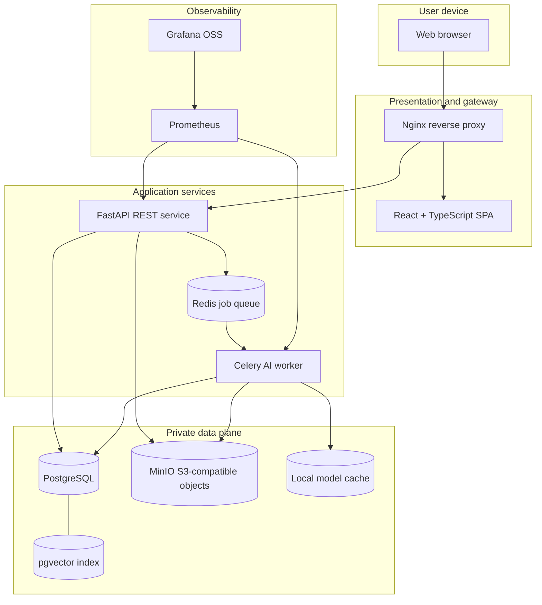
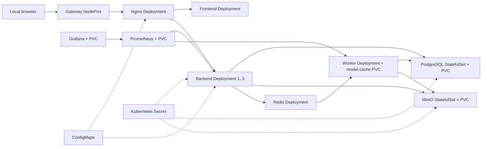

# ImageVault AI architecture

## Architectural intent

ImageVault AI is an intelligent image-management workload deployed on a self-hosted private-cloud platform. The boundary is intentionally local: the application does not send images or embeddings to an external AI or storage API. Services communicate over a private container/Kubernetes network and expose only the gateway, demonstration consoles, and monitoring interfaces.

## Logical architecture



## Upload and processing sequence

```mermaid
sequenceDiagram
    actor User
    participant UI as React UI
    participant API as FastAPI
    participant DB as PostgreSQL/pgvector
    participant S3 as MinIO
    participant Q as Redis
    participant W as AI worker

    User->>UI: Select photos, animations, RAW files, or videos
    UI->>API: POST /api/images/upload + JWT
    API->>API: Validate signature/type/size; calculate SHA-256
    API->>DB: Query same user + SHA-256
    alt exact bytes already exist
        API->>S3: Store private UUID object
        API->>DB: Save EXACT_DUPLICATE and original reference
    else new byte content
        API->>S3: Store private UUID object
        API->>DB: Save PENDING metadata and processing job
    end
    API->>Q: Enqueue image UUID
    API-->>UI: 202 Accepted + exact-match result
    Q->>W: Deliver job
    W->>S3: Read original
    W->>W: Decode representative frames and safe metadata
    W->>W: Thumbnail, OCR/layout, quality, faces, hashes, color/frame evidence
    alt non-exact image
        W->>W: Multi-frame OpenCLIP embedding on CPU or CUDA with CPU fallback
        W->>DB: pgvector cosine nearest-neighbour query
        W->>DB: Store vector and advisory matches
    else exact duplicate
        W->>DB: Reuse original vector when available
    end
    W->>S3: Store WebP thumbnail
    W->>DB: Mark READY / EXACT_DUPLICATE
    UI->>API: Poll gallery, albums, and dashboard
    API-->>UI: Updated processing state
```

## Kubernetes deployment



The backend is stateless and horizontally scalable. PostgreSQL, MinIO, and the one-worker default are deliberately single-instance for a 16 GB student laptop. The optional HPA scales only the backend; it is not required for the base demonstration.

## Trust boundaries

1. **Browser → gateway:** JWT is required for private API routes. Nginx sets request IDs, limits rates, and restricts request sizes.
2. **Gateway → application network:** only internal service names are used. Database, Redis, and backend ports are not published in Compose.
3. **Application → data plane:** database credentials and MinIO keys come from ignored environment files or Kubernetes Secrets.
4. **Application → media:** MinIO buckets are private. The API returns time-limited signed URLs after an ownership-scoped database query.
5. **Observability:** metrics contain counts and timings, not filenames, user IDs, tokens, image content, or secrets.

## Storage mapping

```text
users/{user_uuid}/originals/{image_uuid}.{safe_extension}
users/{user_uuid}/thumbnails/{image_uuid}.webp
```

The original filename is metadata only. UUID keys prevent path traversal, collisions, and accidental overwrite.

## Conceptual public-cloud migration

This is an explanation, not implemented paid infrastructure.

| Current local component | Conceptual managed equivalent |
|---|---|
| MinIO | AWS S3 / Azure Blob Storage / Google Cloud Storage |
| PostgreSQL container | Amazon RDS / Azure Database for PostgreSQL / Cloud SQL |
| Minikube/Kubernetes | EKS / AKS / GKE |
| Nginx gateway | Managed load balancer or API gateway |
| Prometheus + Grafana | Cloud monitoring products or managed Prometheus/Grafana |
| Local model worker | GPU/CPU Kubernetes node pool |

The S3-style object service abstraction, environment configuration, stateless API, and Kubernetes resources reduce migration effort, but networking, IAM, backup, TLS, autoscaling, and cost controls would still require a new design review.
