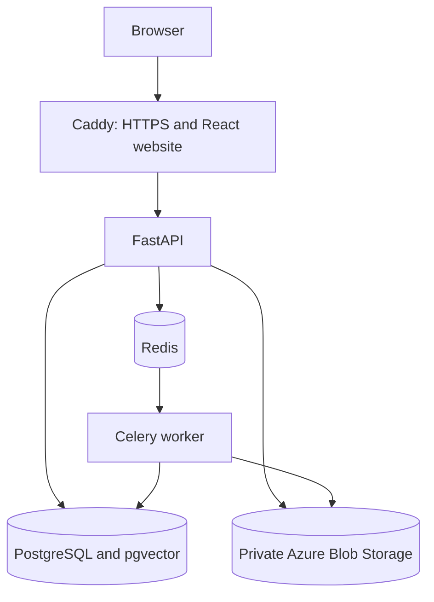

# ImageVault AI architecture

Updated 7 October 2026 for application 1.2.1. Start with
[Windows setup](setup-windows.md); live Azure deployment is still pending.

The primary deployment is a website on an Azure VM, with private Azure Blob Storage. AI inference runs on the VM; images are not sent to a hosted AI API. The VM uses student credit. PostgreSQL, Redis and model caches persist in Docker volumes.

Caddy serves the compiled website, caches hashed assets, and forwards API requests. FastAPI keeps authentication, user isolation, upload quotas, and shared Redis rate limits. Only Caddy publishes public application ports. The private gateway subnet may supply the client address; visitor-supplied headers cannot bypass the limiter. Redis outages fail protected API requests with 503.

## Detection pipeline

1. **Exact bytes:** SHA-256 identifies identical files within an account during upload. A copy can reuse successful analysis and a separately stored thumbnail, avoiding repeated model inference.
2. **Candidate retrieval:** pgvector retrieves nearest normalized CLIP embeddings. The worker also ranks perceptual hash candidates across that account, so a semantically distant copy can still be checked. Candidate limits bound CPU and Blob reads; very large libraries need further tuning.
3. **Verification:** two of pHash, dHash and wHash must agree, with compatible frame geometry and colors. Still-image thumbnails must also agree spatially at two scales before receiving a near-duplicate label. Low-detail inputs, missing verification, animations and video do not receive this label based on a single frame.
4. **Similar content:** strong CLIP matches remain review suggestions. CLIP recognizes meaning and can confuse different shots of the same subject. This result is never selected automatically for cleanup.
5. **Optional enrichment:** OCR, face recognition, labels and quality support advanced exploration. Their failures are recorded on the image and do not discard the duplicate fingerprint result. If the CLIP model is unavailable, fingerprint matching still runs and semantic results remain unavailable until a retry.

All members in a displayed duplicate family must have direct pair evidence. A-B and B-C do not establish A-C. Greedy complete-link grouping favors conservative families and may split some genuinely related images into smaller groups. Bulk selection chooses exact copies only; every deletion still requires confirmation.

## Security and deployment

The VM's managed identity receives Blob Data Contributor access. The private container disallows public blobs and uses expiring, read-only HTTPS preview links. Invitation-based signup, original-file quotas, request limits, private database/queue ports, bounded logs and daily shutdown are configured in the Azure stack. Backups and operational availability still require the owner's attention; a single VM is not a highly available production service.

## Optional academic extensions

The original local Compose stack uses MinIO and Nginx and includes Prometheus/Grafana. Kubernetes examples are in `infra/kubernetes`, with Terraform in `infra/terraform`. These remain available when required by the course rubric, but the Azure website uses Compose and Bicep as its main deployment path.

## Updating older libraries

Migration `0006` adds durable `object_deletions` records. Confirmed deletion commits
metadata removal and object cleanup intent together; the API retries failed Blob
cleanup every 30 seconds and after restart. A worker that recreates a thumbnail
after deletion also schedules cleanup. Blob soft delete may retain billed bytes
for seven days after the vault no longer lists the item.

Queue publication failure retains the original and marks analysis retryable.
After Redis recovers, use the smart-index action; it is not an automatic task outbox.

Analysis version 6 hides older unverified visual matches from duplicate families. After upgrading, click **Duplicate review → Upgrade smart index**, let processing finish, and inspect any warning shown in image details. Warnings make those images eligible for a later retry. Originals are retained during re-analysis. Back up the database and Blob objects before upgrades.
