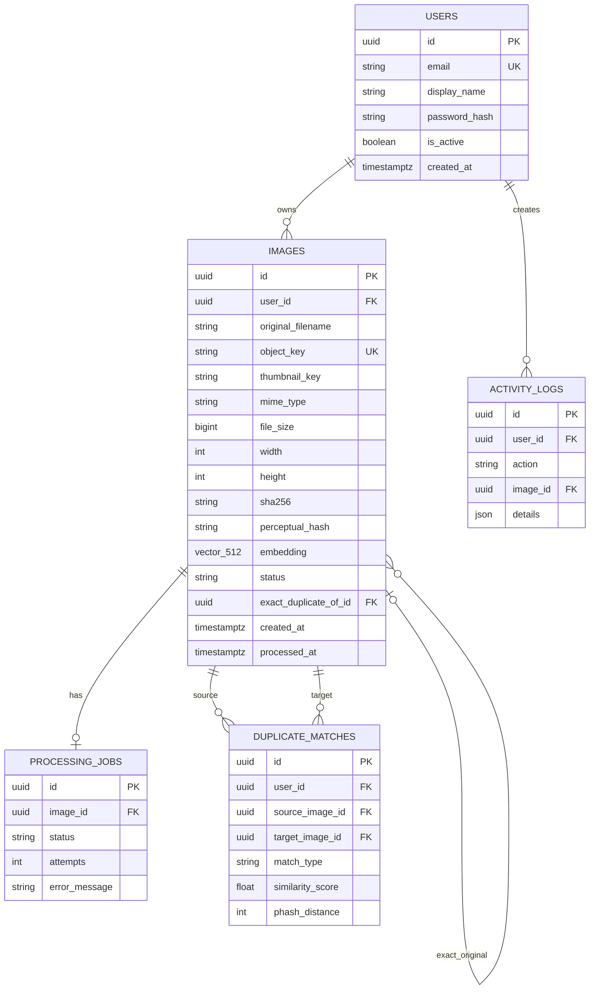
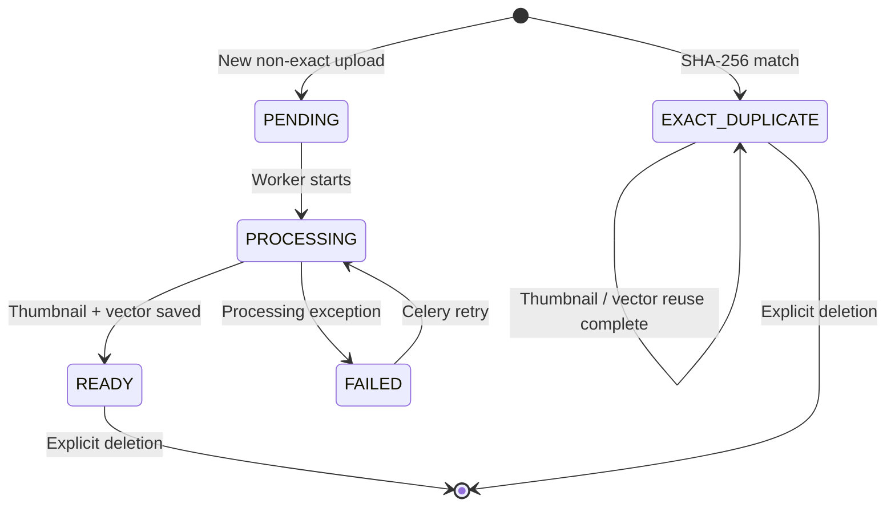

# ImageVault AI technical design document

## Document control

- Version: 1.0 draft
- Project: ImageVault AI
- Authors: `[Student name(s) to be added]`
- Supervisor: `[Supervisor name to be added]`
- Last verified deployment: `[Date and environment to be added after execution]`

## 1. Purpose and scope

The system manages private image collections and highlights waste caused by exact and near-duplicate content. It is also a demonstrable local cloud platform: services are containerized, orchestrated, declared as code, continuously validated, health checked, and observed.

In scope: self-hosted accounts, multi-image upload, MinIO objects, metadata, thumbnails, SHA-256, pHash, OpenCLIP embeddings, pgvector retrieval, gallery, details, duplicate review, storage analytics, explicit deletion, service status, Compose, Minikube, Terraform, CI, metrics, logs, and documentation.

Out of scope for the first release: public internet hosting, high availability, cross-region replication, automatic deletion, facial recognition, OCR, video, email verification, password recovery, and mobile clients.

## 2. Quality attributes

| Attribute | Design response |
|---|---|
| Privacy | No external image/AI API; private MinIO; signed previews; local model cache |
| Security | Argon2, expiring JWT, ownership predicates, MIME/decoder limits, UUID keys, ignored/Kubernetes secrets |
| Availability | Liveness/readiness probes, service health checks, restart policies, retrying jobs |
| Scalability | Stateless API replicas, Redis decoupling, pgvector index, object storage abstraction |
| Observability | Structured JSON logs, request IDs, API/worker Prometheus metrics, provisioned Grafana |
| Portability | Environment configuration, Docker images, Compose, Kubernetes, local Terraform |
| Demonstrability | Synthetic dataset, load generator, reset utility, status page, documented scaling command |
| Cost | Only locally runnable free/open-source components; no paid provider |

## 3. Modules

### Authentication module

Registration validates normalized email, display name, and password length. Argon2 stores a one-way password hash. Login issues an HS256 JWT with subject, issued-at, access type, and expiration claims. Every private route resolves the token to an active local user.

### Image storage module

The API reads each upload with a hard byte limit, checks the declared MIME type, decodes/verifies the content with Pillow, sanitizes the display filename, computes SHA-256, and uses server-generated UUID keys. PostgreSQL stores metadata; MinIO stores bytes.

### Exact duplicate module

Before queueing expensive inference, the API searches `(user_id, sha256)`. A hit sets `EXACT_DUPLICATE`, records `exact_duplicate_of_id`, reports the matched filename, and still preserves the explicitly uploaded object until the user chooses deletion.

### AI processing module

One Celery worker reads the original, extracts safe dimensions/optional EXIF fields, computes pHash, writes a 640×640 maximum WebP thumbnail, and lazily loads OpenCLIP ViT-B/32. It normalizes the 512-dimensional image vector, persists it with pgvector, and queries ten nearest vectors using cosine distance. CUDA is selected only when PyTorch reports it available.

### Duplicate review module

Exact references and `duplicate_matches` rows become review groups. pHash distance and CLIP cosine similarity remain distinct. The UI requires explicit selection and a confirmation dialog; the API additionally requires `confirm=true`.

### Analytics and operations modules

The dashboard calculates user-scoped counts, bytes, recoverable exact-duplicate bytes, seven-day activity, format distribution, and recent images. The status page checks API, PostgreSQL, MinIO, Redis/worker heartbeat, model state, and pending jobs.

## 4. Data model

Indexes support user/time gallery retrieval, user/SHA lookup, statuses, pHash, duplicate lookup, and HNSW vector cosine search. Duplicates are allowed to share the same hash because the product must represent and review each stored object.

## 5. API contract summary

All private queries include the authenticated `user_id` predicate. IDs alone never authorize access.

- `/api/auth/*`: registration, login, current user.
- `/api/images`: filter (`all`, `originals`, `exact`, `similar`, `recent`), search, sort, and pagination.
- `/api/images/upload`: multipart batch, `202 Accepted`.
- `/api/images/{id}` and `/similar`: signed media, metadata, evidence.
- `/api/images/{id}?confirm=true`: explicit deletion of MinIO original, thumbnail, database row, vector, matches, and job.
- `/api/duplicates`, `/dashboard`, `/system/status`: review, analytics, operations.
- `/health/live`: process alive; `/health/ready`: required dependencies ready; `/metrics`: non-sensitive Prometheus data.

The generated OpenAPI contract at `/docs` is the detailed source of truth.

## 6. State transitions

## 7. Failure handling

| Failure | Behavior |
|---|---|
| Invalid/oversized/corrupt upload | Request fails with a user-readable 4xx before object persistence |
| Object write failure | Database transaction is rolled back; written objects are cleaned where possible |
| Queue temporarily unavailable | Upload remains persisted and PENDING; operator sees queue status/log error |
| Worker transient I/O failure | Celery retries with jittered exponential backoff, up to three times |
| Model/inference failure | Image and job become FAILED with a bounded diagnostic; counter increments |
| Database or MinIO unavailable | Readiness returns 503 so orchestration stops sending traffic |
| Redis unavailable | Worker status becomes unhealthy; liveness remains independent |
| Thumbnail unavailable | Signed original is used as gallery fallback |
| Deletion without confirmation | API returns 400 and does not modify state |

An advanced production version would add a durable outbox/requeue mechanism for jobs accepted while Redis is unavailable.

## 8. Security design and residual risk

Controls: password hashing, token expiry, input decoding, size/type allowlists, path-independent UUID keys, CORS allowlist, Nginx limits, ownership checks, private buckets, signed URL expiry, environment secrets, non-root application containers, capability drops, health probes, and non-sensitive metrics.

Residual risks: local `.env` disclosure, host compromise, unencrypted HTTP on the default laptop deployment, weak user-selected passwords, no token revocation list, no malware scanning, and no automated database/object backup. Therefore the project must not be exposed publicly or used as the only copy of irreplaceable media without additional controls.

## 9. Observability design

API metrics include request count/latency/error status, uploads, bytes, and exact duplicates. Worker metrics include processed images, similar matches, inference/processing histograms, failures, queue gauge, and model-loaded state. JSON logs carry timestamp, level, service, request ID, image ID where appropriate, duration, and error context; they deliberately exclude secrets and image data.

Prometheus retains seven days locally. Compose provisions a ten-panel Grafana dashboard; Minikube provisions a compact equivalent. Optional cAdvisor panels display container CPU/memory where the host supports it.

## 10. Deployment and capacity assumptions

- One laptop, 4 CPU allocation, 10–12 GB Docker/Minikube memory, 12+ GB disk.
- One worker to prevent multiple model copies from exhausting memory.
- API memory limit 768 MiB; worker limit 4 GiB; PostgreSQL/MinIO 1 GiB each.
- Model weights are downloaded and cached at runtime; no weights enter Git or Docker build context.
- Prometheus retention is seven days to constrain disk use.

## 11. Testing strategy

- Unit/API tests: auth, rejection, authorization isolation, upload, exact duplicates, health, pHash, normalization, thumbnails.
- Frontend: utility tests, strict TypeScript build, ESLint, production bundling.
- Static infrastructure: Compose resolution, Dockerfile build checks, Kubernetes render, Terraform format/validate.
- Manual integration: first model download, CPU inference, signed MinIO links, full Compose/Minikube health, Grafana traffic, scale demonstration.
- Evidence/results: `[Insert actual test output, screenshots, and benchmark measurements after execution.]`

## 12. Decisions and alternatives

- Redis/Celery was selected over Kafka because the workload needs a small local queue and retry mechanism.
- MinIO was selected over filesystem mounts to demonstrate private object storage and S3 compatibility.
- PostgreSQL/pgvector was selected over a separate vector database to reduce services and keep metadata/vector transactions together.
- OpenCLIP ViT-B/32 balances recognizable similarity with CPU feasibility; the model is replaceable by environment variables.
- Signed MinIO URLs avoid proxying every image through the API while retaining private bucket access.
- Minikube plus Terraform demonstrates orchestration/IaC without pretending a public cloud account is free.
